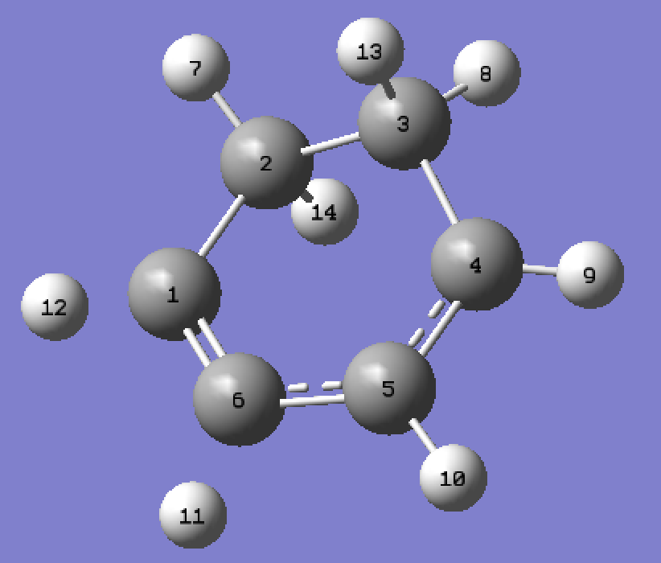
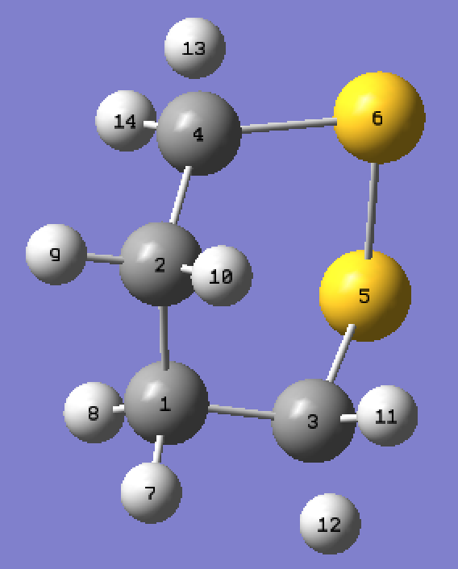
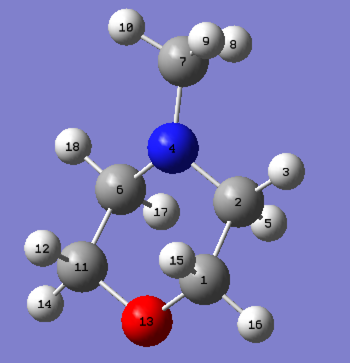
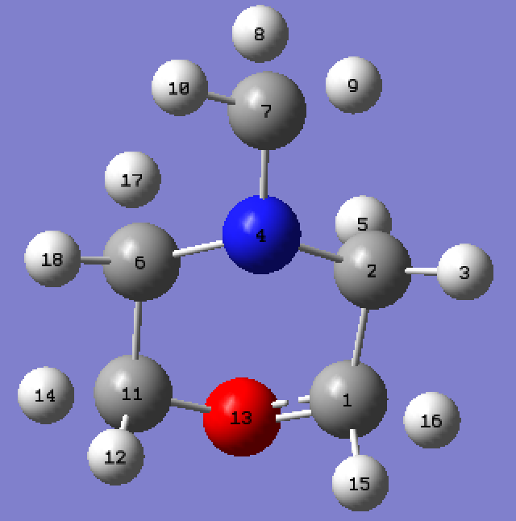

## README

- 1,3-Cyclohexadiene (CHD): 500050 structures
- 1,2-Dithiane (DT): 235963 structures
- N-Methylmorpholine (NMM): Rydberg 1070108 structures + 173997 DFTion structures
- The format of input data (Newgeoms):
  - Newgeoms = (# of structures, # of atoms, Atomic number + Cartesian coordinates in Ångstrom)
  - Newgeoms and I_IAM_pattern are one-to-one matching

- CHD (vertices -> edges)

  C1: (C1, C6), (C1, C2), (C1, H12)

  C2: (C1, C2), (C2, C3), (C2, H7), (C2, H14)

  C3: (C2, C3), (C3, C4), (C3, H13), (C3, H8)

  C4: (C3, C4), (C4, C5), (C4, H9)

  C5: (C4, C5), (C5, C6), (C5, H10)

  C6: (C1, C6), (C5, C6), (C6, H11)

  H7: (C2, H7)

  H8: (C3, H8)

  H9: (C4, H9)

  H10: (C5, H10)

  H11: (C6, H11)

  H12: (C1, H12)

  H13: (C3, H13)

  H14: (C2, H14)

- DT (vertices -> edges)

  C1: (C1, C2), (C1, C3), (C1, H7), (C1, H8)

  C2: (C1, C2), (C2, C4), (C2, H9), (C2, H10)

  C3: (C1, C3), (C3, S5), (C3, H12), (C3, H11)

  C4: (C2, C4), (C4, S6), (C4, H13), (C4, H14)

  S5: (C3, S5), (S5, S6)

  S6: (C4, S6), (S5, S6)

  H7: (C1, H7)

  H8: (C1, H8)

  H9: (C2, H9)

  H10: (C2, H10)

  H11: (C3, H11)

  H12: (C3, H12)

  H13: (C4, H13)

  H14: (C4, H14)

  

- NMM (DFTion)

  C1: (C1, C2), (C1, O13), (C1, H15), (C1, H16)

  C2: (C1, C2), (C2, N4), (C2, H3), (C2, H5)

  H3: (C2, H3)

  N4: (C2, N4), (N4, C6), (N4, C7)

  H5: (C2, H5)

  C6: (N4, C6), (C6, C11), (C6, H17), (C6, H18)

  C7: (N4, C7), (C7, H8), (C7, H9), (C7, H10)

  H8: (C7, H8)

  H9: (C7, H9)

  H10: (C7, H10)

  C11: (C6, C11), (C11, O13), (C11, H12), (C11, H14)

  H12: (C11, H12)

  O13: (C1, O13), (C11, O13)

  H14: (C11, H14)

  H15: (C1, H15)

  H16: (C1, H16)

  H17: (C6, H17)

  H18: (C6, H18)

- NMM (Ryd)

  C1: (C1, C2), (C1, O13), (C1, H15), (C1, H16)

  C2: (C1, C2), (C2, N4), (C2, H3), (C2, H5)

  H3: (C2, H3)

  N4: (C2, N4), (N4, C6), (N4, C7)

  H5: (C2, H5)

  C6: (N4, C6), (C6, C11), (C6, H17), (C6, H18)

  C7: (N4, C7), (C7, H8), (C7, H9), (C7, H10)

  H8: (C7, H8)

  H9: (C7, H9)

  H10: (C7, H10)

  C11: (C6, C11), (C11, O13), (C11, H12), (C11, H14)

  H12: (C11, H12)

  O13: (C1, O13), (C11, O13)

  H14: (C11, H14)

  H15: (C1, H15)

  H16: (C1, H16)

  H17: (C6, H17)

  H18: (C6, H18)

