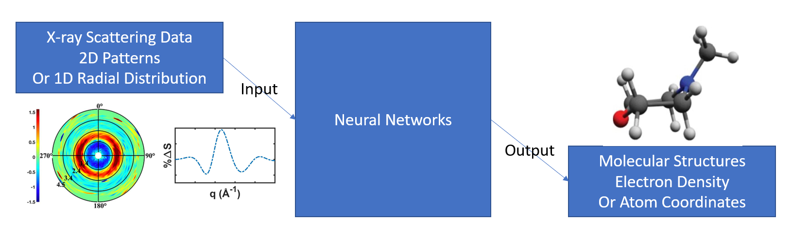

# Xstructure

**Dawei Si (dsi1), Lingyu Ma (lma21)**

## Introduction

X-ray scattering is one of the state-of-art materials characterization techniques that measure materials'
structural and dynamical properties with high precision. Based on the scattering patterns, it is possible to
retrieve the geometric structure of gas-phase molecules with sub-Ångstrom spatial and femtosecond temporal
resolution. However, structural retrieval becomes progressively difficult with increasing structural
complexity, given that a global extremum must be found in multi-dimensional solution space. Even worse,
pre-calculating many thousands of molecular configurations for all orientations becomes simply intractable.
The strong predictive power and capacity for representation learning enable machine learning models to
perform comparably to more expensive numerical models, like first-principles calculations, at a much lower
computational cost. Machine learning models can distill complex structural information and be trained to
acquire interatomic force field and potential energy surface.

The scattering intensity can be represented as a high dimensional array (**I**), indexed by momentum **k**,
energy ω, and polarization ε. Such data structures are naturally compatible with convolutional neural
networks (CNNs), which are widely applied in image processing. Atomic structures can also be interpreted as
images by regarding them as density fields based on atomic species and positions on 3D real-space grid, which
enable them to work with convolutional filters. After radial averaging of the scattering intensity, we can
obtain the isotropic scattering signal which can be represented as a 1-D vector, considering the
time-sequence of the experimental signals, Recurrent Neural networks like LSTMs, GRUs, are also suitable to
solve this problem. Our goal is to interpret X-ray scattering signals and figure out their corresponding
molecular structures. The problem we want to solve is regression.

## Related Work

In recent years, X-ray, electron, and neutron scattering have received a significant boost due to the
development and increased application of machine learning to materials problems. With the integration of
machine learning methods into the typical workflow of scattering experiments, problems that challenge
traditional analysis approaches can be addressable, including leveraging the knowledge of simple materials to
model more complicated systems, learning with limited data or incomplete labels, identifying meaningful
spectra and materials, mitigating spectral noise, and others.

List of the related work:

- [Machine learning on neutron and x-ray scattering and spectroscopies](https://aip.scitation.org/doi/full/10.1063/5.0049111)
- [Machine learning for laser-induced electron diffraction imaging of molecular structures](https://arxiv.org/abs/2110.06097)
- [Transferable Machine-Learning Model of the Electron Density](https://pubs.acs.org/doi/abs/10.1021/acscentsci.8b00551)

## Data

We need a number of X-ray scattering patterns from various different structures and different molecules.
Based on previous theoretical work, we can create structure pools of million trial structures and generate
their corresponding theoretical scattering patterns used as our training and test dataset. There're three
different ways to create structure pools, molecular dynamics simulations (MD), a Monte Carlo (MC) based
approach, sampling from a quantum Wigner distribution. In terms of the model/theory, we'd like to simulate
the scattering pattern, Independent Atom Model (IAM) would work well for our purpose.

The structure pool would contain more than one million geometries of several different molecules, with the
corresponding scattering pattern for each geometry. It would need to do significant preprocessing.

## Methodology

The basic architecture of the procedure in this work is as the following figure:

X-ray scaterring results from experiments or theoretical simulations are fed into neural networks, and the
structures of their corresponding molecules are predicted. For example, the X-ray scattering pattern (the
plot on the left) can be recognized to has the structure of N-Methylmorpholine (that on the right).

### Data Representation

There are two types of representation for the input patterns. One is directly using the 2D images like we can
measure in experiments, as shown in the green plot in the above figure. Algorithms working well on images
might be also applied well to the data, but the information might be more redundant.

The other one is taking the average of the scattering intensity and plotting it with respect to the radius,
(like the curve plot in the figure), so each 2D pattern is represented in an one-dimensional vector. Thus,
the information is like time sequence and it is more suitable for the algorithms designed for 1D signals.

Since the output is molecular structures, there are also two ways to describe them. Each atom in the molecule
can be located by their cartesian coordinates in the space, or the electron density of the whole molecule can
be calculated. The first method has a limit number of atoms, while with the second method the space is more
limited. Note that atomic numbers should also be included with the 3D coordinates to distinguish different
elements. 

The root-mean-square deviation (RMSD) of atomic positions between predicted and labelled structures can be
used as loss function, as it is a measurement of how similar two molecular structures are to each other.

### Convolutional Neural Networks

CNNs are widely used to extract information and do classification tasks for image data. They are very suited
for tasks like recognizing subtle features in an image that are difficult for human brains to identify. In
this project, we will attempt several types of CNNs for the 2D patterns. 

### Recurrent Neural Networks

RNNs like LSTMs and GRUs might also be helpful for our project, since the input can also be represented as 1D
signals. RNNs are useful to identify the dynamics of physical systems. 

## Metrics

The accuracy in this project is defined as the average number of succeeded recognization of molecules.

By the final due date, we should finish preparing and preprocessing the data for both training and testing,
understanding how other researchers are studying similar problems, and setting up a procedure to test
different kinds of models. At least one CNN and one RNN-based neural networks are tested to see their ability
for this task.

We also plan to design and test more models. Hopefully, a working model that has an accuracy > 50% could be
found. We may also provide this tool to experimentalist for realtime fast data analysis in their labs.

## Ethics

Given the current repetition rate of the state-of-art experimental techniques, 120 Hz for X-ray scattering
and 50000 Hz for keV-UED, it's very hard for experimentalist to analyze these scattering patterns on the fly
by using traditional methods during experiments. With the help of deep learning, it makes possible to do
real-time fast data-analysis for experimentalists. The obtained information would guide the experiment and
offer valuable insights.

Since this project is designed as a tool for experimentalists instead of taking over all jobs of a human, we
plan to quantify the success by how much more efficiency it helps improve in the labs. And depending on how
experimentalists are relying on the tool, it might also cause mistakes.

## Division of labor

- Lingyu: Generate data, preprocessing, investigate suitable Neural Networks (NN), training
- Dawei: Preprocessing,  Investigate suitable NNs, training

## Challenges

When we explore suitable Neural Networks for our project, we've encountered the following challenges:

- Currently, we can not come up with a suitable neural network that can be used as **a general molecular scattering pattern interpreter**. To be more specific, our input data is *simulated scattering pattern* + *atomic numbers of the corresponding molecule*, and the output is the 3D cartesian coordinates for each atom within the molecules. No matter we use GNN, RNN, Transformer, or just CNN, its trained weights or embeddings are just for one specific molecular since different molecules might have a different number of atoms (e.g. N-methlymorpholine C5H11NO has 18 atoms while 1,2-Dithiane C4S2H8 has only 14 atoms), different connections between atoms (e.g. C-N, C-O bonds in N-methylmorphine and C-S, S-S bonds in 1,2-Dithiane), and etc. Furthermore, the input size and output size are not fixed for different molecules, because of the different number of atoms within different molecules,  the size of the output is changing with respect to the input size. Because of these constrictions, we can only build one NN for one molecule and haven't found a general molecular scattering pattern interpreter yet. 
- The molecular structures in our structure pool are close to each other, for example, we've estimated the maximum relative percent difference between two scattering patterns is around 7% for the corresponding two molecular structures of NMM. Given the architecture of NN we've built now, i.e. use several layers of CNN as an encoder to encode the information in the scattering pattern, and the output of the CNN as the initial state for the following RNN which is used to recover the 3D cartesian coordinates for the molecule, it seems that every time we trained the NN, it finds some local/artificial structures which sit around in the middle of the structure pool. It would give a small loss but always the same structure, kind of like the model collapse in GAN. Therefore, we have some trouble finding or tuning the architecture of NN to suitably solve our problem. 

## Insights

- We've built our neural network, trained, and tested on it. But we found the problem as mentioned in the second bullet point in the Challenges section. Therefore, we haven't had concrete results at this point. 
- Actually, we originally expected that our model should work and give us some kind of reasonably predicted structures. In reality, our current model can not tell those subtle structural differences in the structure pool and have some issues with correct prediction. 

## Plan

- First, we would like to resolve the issues we've met in the current model, i.e. letting one molecular interpreter NN normally function. We will try to re-process our data to magnify the differences between the scattering patterns w.r.t different molecular structures, tune the architecture of the current model to strengthen the recognization ability. (*Dedicate more time to this task*)
- Then, we will build such one molecular scattering pattern interpreter for each kind of molecule we have, and probably compare the quality of their predictions. We have one million structures for N-methylmorpholine (NMM), half-million structures for 1,3-cyclohexadiene (CHD), and around half-million structures for 1,2-Dithiane (DT). 
- Finally, we hope that with the help/insights from TA, we could construct a general molecular scattering pattern interpreter, which could predict different molecular structures given different kinds of scattering patterns. (*If it is possible, we'll try for it*)